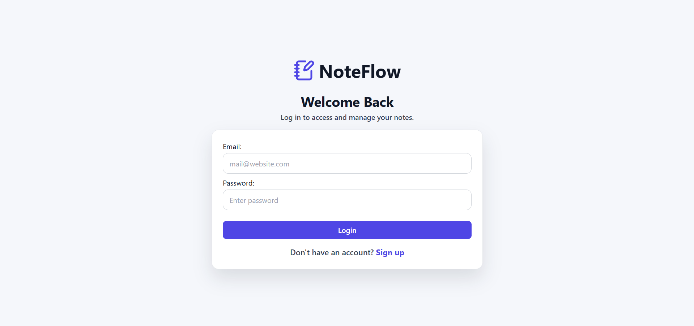
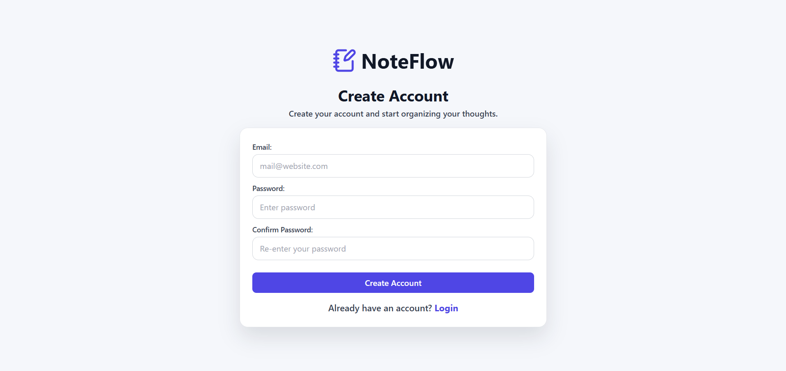
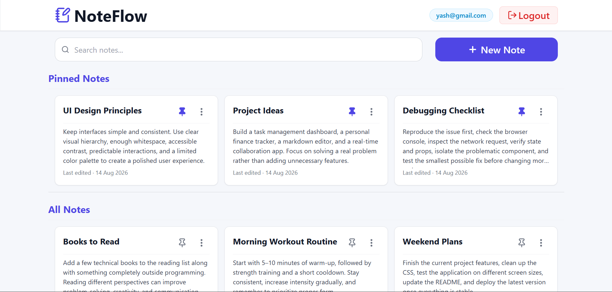
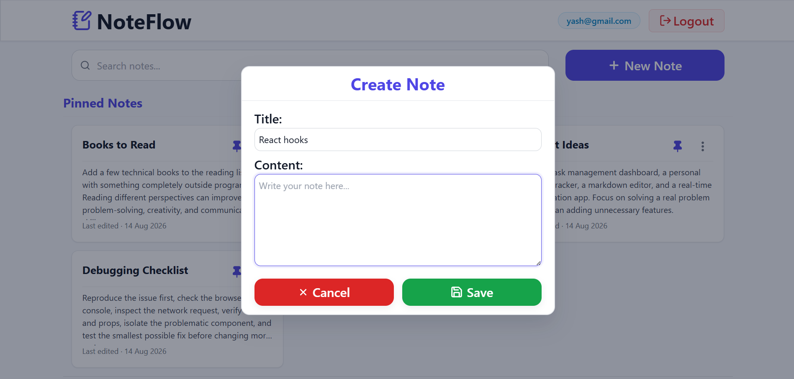
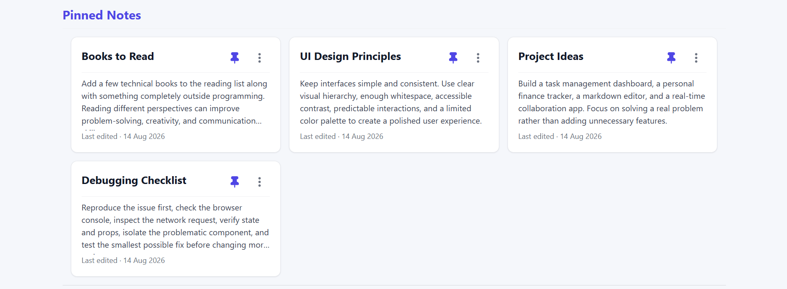
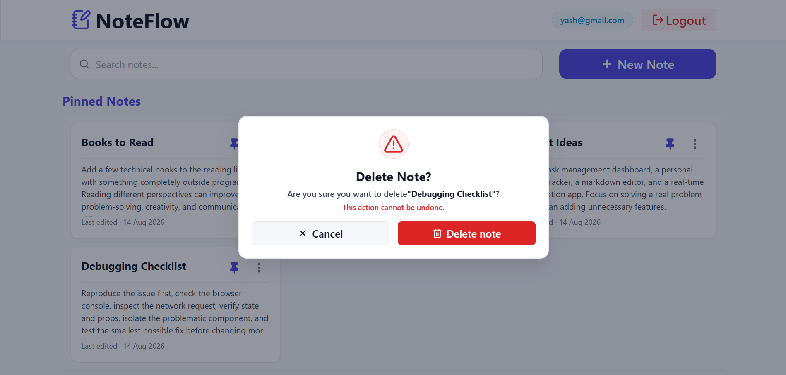

# 📝 NoteFlow

> A modern, responsive notes management application built with React and Firebase.

NoteFlow is a full-featured notes application that allows users to securely create, manage, search, pin, edit, and delete their personal notes.

The application uses **Firebase Authentication** for user authentication and **Cloud Firestore** for real-time data synchronization. Each user's notes are associated with their authenticated user ID, while Firestore Security Rules ensure that users can only access and modify their own notes.

---

## 🌐 Live Demo

🔗 **Live Demo:** [View NoteFlow](https://noteflow-yash.netlify.app/)

---

## 📸 Screenshots

### 🔐 Login

### 📝 Sign Up

### 🏠 Dashboard

### ✏️ Create / Edit Note

### 📌 Pinned Notes

### 🗑️ Delete Confirmation

---

## ✨ Features

### 🔐 Authentication

- User registration with email and password
- User login and logout
- Persistent authentication state
- Protected dashboard route
- Authentication state managed using React Context API
- Firebase Authentication error handling

### 📝 Note Management

- Create new notes
- Edit existing notes
- Delete notes with confirmation
- Pin and unpin notes
- Automatically store creation and update timestamps
- Real-time synchronization with Firestore
- Notes are associated with the authenticated user

### 🔎 Search

- Search notes by title
- Search notes by content
- Search across pinned and regular notes
- Client-side filtering for a responsive experience

### 🎨 User Interface

- Clean Arctic Blue inspired light theme
- Responsive desktop, tablet, and mobile layout
- Reusable React components
- Loading states
- Empty states
- Error states
- Confirmation modal for destructive actions
- Dropdown menu for note actions
- Accessible modal structure
- Lucide icons throughout the application

### 🔒 Security

- User-specific Firestore queries
- Firestore Security Rules
- Users can only access their own notes
- Create, read, update, and delete operations are authorized using the authenticated user's UID

---

## 🛠️ Tech Stack

### Frontend

- **React**
- **JavaScript (ES6+)**
- **React Router**
- **CSS3**
- **Lucide React**

### Backend / Services

- **Firebase Authentication**
- **Cloud Firestore**

### Development Tools

- **Vite**
- **ESLint**
- **Git**
- **GitHub**

---

## 🏗️ Application Architecture

    NoteFlow
        │
        ├── Firebase Authentication
        │       │
        │       └── AuthContext
        │               │
        │               └── ProtectedRoute
        │
        └── Cloud Firestore
                │
                └── Notes Collection
                        │
                        ├── Create
                        ├── Read
                        ├── Update
                        ├── Delete
                        └── Real-time Updates
                                │
                                ▼
                            Dashboard
                                │
                    ┌───────────┼───────────┐
                    │           │           │
                 Search      NoteList     Modals
                                │       ┌────┴────┐
                                │    NoteForm  Delete
                                │
                            NoteCard

---

## 📂 Project Structure

    NoteFlow/
    │
    ├── public/
    │
    ├── src/
    │   │
    │   ├── components/
    │   │   ├── DeleteConfirm.jsx
    │   │   ├── Loader.jsx
    │   │   ├── Navbar.jsx
    │   │   ├── NewNoteButton.jsx
    │   │   ├── NoteCard.jsx
    │   │   ├── NoteForm.jsx
    │   │   ├── NoteList.jsx
    │   │   ├── ProtectedRoute.jsx
    │   │   ├── SearchBar.jsx
    │   │   └── SmallLoader.jsx
    │   │
    │   ├── context/
    │   │   └── AuthContext.jsx
    │   │
    │   ├── firebase/
    │   │   └── firebase.js
    │   │
    │   ├── pages/
    │   │   ├── Dashboard.jsx
    │   │   ├── Login.jsx
    │   │   └── Signup.jsx
    │   │
    │   ├── App.jsx
    │   └── index.css
    │
    ├── .env.example
    ├── .gitignore
    ├── package.json
    └── README.md

---

## 🔥 Firebase Integration

### Authentication

NoteFlow uses **Firebase Authentication** with the Email/Password provider.

The application uses:

- `createUserWithEmailAndPassword()` for user registration
- `signInWithEmailAndPassword()` for login
- `signOut()` for logout
- `onAuthStateChanged()` to monitor authentication state

Authentication state is centralized using React Context API through `AuthContext`.

This allows the application to determine the currently authenticated user and protect private routes.

### Cloud Firestore

NoteFlow uses **Cloud Firestore** as its cloud database.

Notes are stored in the `notes` collection.

Each note contains fields similar to:

    {
        title: string,
        content: string,
        userId: string,
        pinned: boolean,
        createdAt: Timestamp,
        updatedAt: Timestamp
    }

---

## ⚡ Real-Time Data Synchronization

NoteFlow uses Firestore's `onSnapshot()` listener instead of performing one-time data fetching.

    Firestore
        │
        │ Data changes
        ▼
    onSnapshot()
        │
        ▼
    React State
        │
        ▼
    Components re-render

This means changes such as creating, editing, pinning, or deleting a note are automatically reflected in the UI without requiring a page refresh.

---

## 🔄 CRUD Operations

| Operation | Firestore Method |
|-----------|------------------|
| Create Note | `addDoc()` |
| Read Notes | `onSnapshot()` |
| Update Note | `updateDoc()` |
| Delete Note | `deleteDoc()` |

---

## 🔐 Firestore Security

Firestore Security Rules are used to protect user data.

Each note stores the authenticated user's UID in the `userId` field.

The application also queries notes using the authenticated user's UID.

    Authenticated User
            │
            ▼
      request.auth.uid
            │
            ▼
      Compare with note.userId
            │
        ┌───┴────┐
        │        │
      Match   No Match
        │        │
      Allow     Deny

This provides database-level authorization rather than relying only on frontend filtering.

Users cannot access or modify another user's notes through unauthorized Firestore requests.

---

## 🧠 React Concepts Used

NoteFlow makes practical use of several important React concepts:

- `useState`
- `useEffect`
- `useContext`
- Controlled form inputs
- Conditional rendering
- Component composition
- Props
- Callback functions
- React Context API
- Protected routes
- Real-time state synchronization
- Reusable components
- Form validation
- Asynchronous operations

---

## 📱 Responsive Design

NoteFlow is designed to provide a consistent experience across desktop, tablet, and mobile devices.

### Desktop

- Three-column note grid
- Horizontal search and action controls
- Full navigation information

### Tablet

- Two-column note grid
- Adjusted spacing and typography

### Mobile

- Single-column note layout
- Stacked search and New Note controls
- Compact navigation
- Responsive modals and forms
- Responsive note menus
- Scaled typography using `rem`

---

## 🎨 Design System

NoteFlow uses a custom **Arctic Blue inspired light theme**.

The interface uses centralized CSS variables for:

- Colors
- Typography
- Font weights
- Spacing
- Border radius
- Shadows
- Inputs
- Buttons
- Cards
- Modals
- Icons
- Transitions
- Z-index values
- Layout
- Responsive breakpoints

Using CSS variables keeps the visual design consistent throughout the application and makes future theme modifications easier.

---

## ⚙️ Getting Started

### Prerequisites

Make sure you have the following installed:

- [Node.js](https://nodejs.org/)
- npm
- Git

### 1. Clone the Repository

    git clone https://github.com/codewithyashsoni/note-flow.git

### 2. Navigate to the Project

    cd noteflow

### 3. Install Dependencies

    npm install

### 4. Configure Firebase

Create a Firebase project and enable:

- **Authentication**
  - Email/Password provider
- **Cloud Firestore**

Create a `.env` file in the project root.

Use `.env.example` as a reference:

    VITE_FIREBASE_API_KEY=your_api_key
    VITE_FIREBASE_AUTH_DOMAIN=your_auth_domain
    VITE_FIREBASE_PROJECT_ID=your_project_id
    VITE_FIREBASE_STORAGE_BUCKET=your_storage_bucket
    VITE_FIREBASE_MESSAGING_SENDER_ID=your_messaging_sender_id
    VITE_FIREBASE_APP_ID=your_app_id

### 5. Start the Development Server

    npm run dev

The application will be available at the local development URL provided by Vite.

---

## 🔑 Environment Variables

The following environment variables are required:

    VITE_FIREBASE_API_KEY
    VITE_FIREBASE_AUTH_DOMAIN
    VITE_FIREBASE_PROJECT_ID
    VITE_FIREBASE_STORAGE_BUCKET
    VITE_FIREBASE_MESSAGING_SENDER_ID
    VITE_FIREBASE_APP_ID

The actual `.env` file should **not** be committed to the repository.

A `.env.example` file is included to show the required configuration structure.

---

## 🧪 Application Flow

    User
      │
      ├── Sign Up
      │       │
      │       ▼
      │   Firebase Auth
      │       │
      │       ▼
      │   AuthContext
      │       │
      │       ▼
      │   ProtectedRoute
      │       │
      │       ▼
      │   Dashboard
      │
      └── Login
              │
              ▼
          Firebase Auth
              │
              ▼
          AuthContext
              │
              ▼
          ProtectedRoute
              │
              ▼
          Dashboard

    Dashboard
        │
        ├── Search Notes
        │
        ├── Create Note
        │       │
        │       ▼
        │   Firestore
        │
        ├── Edit Note
        │       │
        │       ▼
        │   Firestore
        │
        ├── Pin / Unpin
        │       │
        │       ▼
        │   Firestore
        │
        └── Delete Note
                │
                ▼
            Confirmation
                │
                ▼
            Firestore

---

## 📊 Core Data Flow

    User Authentication
            │
            ▼
        Firebase Auth
            │
            ▼
        AuthContext
            │
            ▼
        Dashboard
            │
            ▼
    Query notes using user.uid
            │
            ▼
        Cloud Firestore
            │
            ▼
        onSnapshot()
            │
            ▼
        React State
            │
            ▼
        NoteList
            │
            ▼
        NoteCard

---

## 📸 Screenshot Folder Structure

Add your screenshots to a `screenshots` folder in the project root.

    NoteFlow/
    │
    ├── screenshots/
    │   ├── login.png
    │   ├── signup.png
    │   ├── dashboard.png
    │   ├── note-form.png
    │   ├── pinned-notes.png
    │   └── delete-confirmation.png
    │
    └── README.md

---

## 🚀 Future Improvements

Possible future enhancements include:

- Password reset
- Email verification
- Note categories and tags
- Advanced sorting and filtering
- Rich text editing
- Note archiving
- Profile management
- Toast notifications
- Dark mode

---

## 📚 Learning Outcomes

Building NoteFlow provided practical experience in developing a complete React application connected to a cloud backend and authentication service.

Key learning outcomes include:

- Building reusable React components
- Managing authentication state using Context API
- Implementing protected routes
- Working with Firebase Authentication
- Performing Firestore CRUD operations
- Using real-time Firestore listeners
- Associating database records with authenticated users
- Implementing Firestore Security Rules
- Handling asynchronous operations
- Managing loading, empty, and error states
- Implementing form validation
- Building responsive interfaces using CSS
- Creating reusable design tokens with CSS variables
- Structuring a maintainable React project

---

## 👨‍💻 Author

### Yash Soni

**B.Tech Computer Science & Engineering**

---

## 📄 License

This project was created for educational and portfolio purposes.